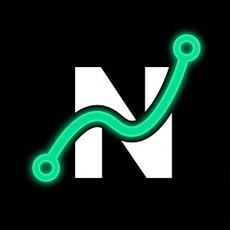

<div align="center">



# Nexus AdLead Finder 🚀
**Prospecção B2B, Mineração Meta Ads & Qualificação Inteligente com Gemini AI**

*Parte do ecossistema de soluções de inteligência comercial **Nexus** (ao lado do NexusVBO).*

[](https://go.dev/)
[-003B57?style=flat&logo=sqlite)](https://modernc.org/sqlite)
[](https://ai.google.dev/)
[](https://developers.facebook.com/)
[](LICENSE)

</div>

---

## 📖 Visão Geral

O **Nexus AdLead Finder** é uma aplicação desktop/local de alta performance desenvolvida em **Go (Golang)** voltada para agências, consultorias e times comerciais B2B. Ele extrai anunciantes ativos diretamente da **Meta Ad Library (Graph API v21.0)**, realiza a raspagem concorrente de Landing Pages para identificar canais de contato e qualifica a maturidade comercial de cada empresa utilizando o **Google Gemini AI**.

Todo o frontend SPA moderno (Tailwind CSS + Alpine.js + Lucide Icons) é embutido diretamente no binário final compilado (`//go:embed`), permitindo que toda a solução seja distribuída e executada como um único arquivo `.exe` autônomo, sem dependências de Node.js, CGO ou drivers externos.

---

## ✨ Funcionalidades Principais

* 🔍 **Mineração Oficial na Meta Ads Library (Graph API):** Busca ao vivo por nicho ou palavra-chave com paginação contínua (cursor `after`), entregando o número exato de **empresas distintas** solicitadas (10, 25, 50 ou 100).
* 🏷️ **Identificação Automática da Área de Atuação (`business_segment`):** O modelo Gemini analisa os criativos e identifica o ramo de atividade específico da empresa anunciante (ex: *Energia Solar Fotovoltaica*, *Clínica Odontológica*, *Advocacia Empresarial*).
* ✍️ **Editor de Pitch & Oferta Customizável:** Painel retrátil para cadastrar sua oferta comercial padrão (com persistência no navegador via `localStorage`). A IA encadeia sua oferta automaticamente após o icebreaker em todas as abordagens.
* 💬 **Modal Dedicado "Ver Copy":** Visualização completa da mensagem gerada, diagnóstico detalhado da maturidade da empresa e ações diretas de 1-clique.
* 🌐 **Acesso Rápido ao Site / Landing Page:** Link direto em cada lead para inspecionar a página do anunciante.
* 🗑️ **Gestão Completa de Leads (CRUD):** Botão de exclusão visível (`DELETE /api/leads/{id}`) e alternador de status (*Novo*, *Contatado*, *Descartado*).
* ⚡ **Scraping Concorrente Ultrarrápido:** Extração paralela de contatos das Landing Pages (WhatsApp, E-mails e Instagram).
* 🧠 **Qualificação Inteligente com Gemini 3.7 Flash:** Score de maturidade (1 a 10), diagnóstico de funil e geração de icebreakers altamente personalizados em Português do Brasil.
* 📊 **Exportação CSV:** Download de toda a base qualificada com suporte total a acentuação e compatibilidade com Microsoft Excel.
* 🌓 **Modos Claro, Escuro e Sincronização com o Sistema Operacional.**

---

## 🔑 Como Obter o `META_ACCESS_TOKEN` (Passo a Passo Detalhado)

A Meta Ads Library API exige autenticação oficial via Graph API. Siga este tutorial completo para criar seu aplicativo e gerar o token de acesso:

### 1. Acessar o Portal de Desenvolvedores
1. Acesse **[developers.facebook.com](https://developers.facebook.com/)**.
2. Faça login com a sua conta pessoal do Facebook.
3. Se for seu primeiro acesso, clique em **Começar** (Get Started) e siga as instruções para registrar sua conta como desenvolvedor.

---

### 2. Criar um Aplicativo Meta (App)
1. No menu superior, clique em **Meus Aplicativos** (My Apps) e depois no botão verde **Criar Aplicativo** (Create App).
2. Selecione o caso de uso: escolha a opção **"Outro"** (Other) ou **"Negócios"** (Business) e clique em **Avançar**.
3. Selecione o tipo de aplicativo: **Empresa / Negócios** (Business).
4. Preencha as informações do aplicativo:
   - **Nome de exibição do aplicativo:** Ex: `NexusAdLead`
   - **E-mail de contato:** Seu e-mail de preferência.
   - **Conta do Portfólio Empresarial (opcional):** Selecione sua conta do Gerenciador de Negócios se possuir.
5. Clique em **Criar Aplicativo**.

---

### 3. Adicionar o Produto "Marketing API"
1. No painel principal do seu aplicativo recém-criado, role até a seção **Adicionar Produtos**.
2. Localize o card **Marketing API** e clique no botão **Configurar** (Set Up).
3. *(A Meta enviará um e-mail de confirmação: "Welcome to the Meta Marketing API! - NexusAdLead").*

---

### 4. Confirmação de Identidade do Desenvolvedor (Obrigatório pela Meta)
Para liberar o acesso aos dados da Biblioteca de Anúncios (`ads_archive`), a Meta exige que o desenvolvedor tenha a identidade confirmada:
1. **Ativar Autenticação de Dois Fatores (2FA):** Certifique-se de que sua conta do Facebook possui 2FA ativado (via app autenticador ou SMS).
2. **Validação de Identidade no Aplicativo do Celular:**
   - Abra o aplicativo do **Facebook** no seu celular.
   - Vá em **Menu (☰) > Configurações e Privacidade > Central de Contas (Meta) > Dados Pessoais > Confirmação de Identidade**.
   - Siga o fluxo enviando a foto de um documento oficial (RG, CNH ou Passaporte).
   - A confirmação costuma ser aprovada em poucos minutos (ou até 24-48 horas em alguns casos).

---

### 5. Gerar o Token de Acesso (Graph API Explorer)
1. Acesse a ferramenta **[Graph API Explorer](https://developers.facebook.com/tools/explorer/)**.
2. No canto superior direito, configure os seguintes campos:
   - **Aplicativo da Meta:** Selecione o seu app (ex: `NexusAdLead`).
   - **Usuário ou Página:** Selecione **Token de Acesso do Usuário** (User Token).
3. Na seção **Permissões** (Permissions), clique em *Adicionar Permissão* e selecione:
   - `ads_read`
   - `read_insights`
   - `public_profile`
4. Clique no botão azul **Generate Access Token** (Gerar Token de Acesso).
5. Uma janela popup do Facebook será aberta solicitando autorização. Confirme todas as permissões.
6. O seu token aparecerá gerado no campo **Access Token** (inicia com `EAA...`).

---

### 6. (Recomendado) Estender para Token de Longa Duração (60 Dias)
Por padrão, tokens do Graph API Explorer expiram em algumas horas. Para transformá-lo em um token de **60 dias**:
1. Acesse o **[Depurador de Tokens de Acesso](https://developers.facebook.com/tools/debug/accesstoken/)**.
2. Cole o token gerado no passo anterior e clique em **Depurar** (Debug).
3. No final da página de diagnóstico, clique no botão **Estender Token de Acesso** (Extend Access Token).
4. Insira a senha do seu Facebook caso seja solicitado.
5. Copie o novo token de longa duração gerado.

> 💡 **Dica Avançada (Token Permanente):** Caso queira um token que nunca expire, você pode criar um **Usuário do Sistema** (System User) dentro das *Configurações do Negócio (Meta Business Suite)*, atribuir o aplicativo a ele com as permissões `ads_read` e gerar um token permanente.

---

## 🛠️ Stack Tecnológica

| Camada | Tecnologia | Detalhes |
| :--- | :--- | :--- |
| **Linguagem & Backend** | Go (Golang) 1.22+ | Compilação nativa para Windows sem dependências externas |
| **Roteador HTTP** | `github.com/go-chi/chi/v5` | Roteador leve com middlewares de timeout e CORS |
| **Banco de Dados** | `modernc.org/sqlite` | Driver SQLite 100% puro em Go (sem necessidade de CGO/MinGW) |
| **Scraping Concorrente** | `github.com/PuerkitoBio/goquery` | Extração concorrente de tags, telefones e e-mails no DOM |
| **Inteligência Artificial**| Google Gemini 3.7 Flash | Qualificação estruturada em JSON, icebreakers e segmentação |
| **Frontend Embutido** | Tailwind CSS + Alpine.js | Dashboard SPA empacotado via `//go:embed static/*` |

---

## 📂 Estrutura do Projeto

```text
adlead-finder/
├── cmd/
│   └── server/
│       └── main.go           # Ponto de entrada, servidor HTTP e graceful shutdown
│
├── internal/
│   ├── config/
│   │   └── config.go         # Carregamento de variáveis de ambiente (.env)
│   ├── db/
│   │   └── sqlite.go         # Conexão SQLite leads.db, auto-migration e CRUD
│   ├── meta/
│   │   └── client.go         # Cliente da Meta Graph API v21.0 com paginação de empresas
│   ├── scraper/
│   │   └── scraper.go        # Worker pool concorrente para varredura de Landing Pages
│   ├── ai/
│   │   └── gemini.go         # Qualificador Gemini 3.7 Flash com cadeia de fallback
│   └── handlers/
│       └── routes.go         # Endpoints REST, exportação CSV e bridge estático
│
├── web/
│   ├── embed.go              # Diretiva //go:embed static/*
│   └── static/
│       ├── logo.png          # Logotipo Nexus
│       ├── favicon.png       # Favicon
│       ├── index.html        # Dashboard SPA completo com modal de copy e editor de pitch
│       ├── app.js            # Lógica reativa Alpine.js e persistência de pitch
│       └── style.css         # Estilos glassmorphism e temas claro/escuro
│
├── build.bat                 # Script de compilação Windows (.exe otimizado)
├── start.bat                 # Script de inicialização e abertura automática do navegador
├── .env.example              # Modelo público de variáveis de ambiente
├── .env                      # Arquivo local de chaves de API (ignorado no Git)
├── go.mod
└── README.md
```

---

## 🚀 Como Executar Localmente

### 1. Configurar o arquivo `.env`
Crie ou edite o arquivo `.env` na raiz do projeto:

```env
# Porta do Servidor Local
PORT=8080

# Token da Meta Graph API (conforme tutorial acima)
META_ACCESS_TOKEN=seu_meta_token_aqui

# Chave da API do Google AI Studio (Gemini)
GEMINI_API_KEY=sua_chave_gemini_aqui

# Ambiente
ENV=development
```

> 🔒 **Segurança:** O arquivo `.env` e a base `leads.db` são estritamente ignorados pelo `.gitignore` e nunca são versionados.

---

### 2. Execução Rápida no Windows (Recomendado)

Dê um duplo clique no arquivo **`start.bat`** (ou execute no terminal):

```cmd
.\start.bat
```

O script compilará o binário (se necessário), iniciará o serviço e abrirá o navegador automaticamente em:
👉 **`http://localhost:8080`**

---

### 3. Execução Manual via Go CLI

**Modo de desenvolvimento:**
```bash
go run ./cmd/server/main.go
```

**Compilar binário de produção otimizado:**
```bash
go build -ldflags="-s -w" -o adlead-finder.exe ./cmd/server/main.go
```

---

## 🔌 Endpoints da API REST

| Método | Endpoint | Descrição |
| :--- | :--- | :--- |
| `POST` | `/api/search` | Minera anúncios na Meta, faz scraping de LP, qualifica com Gemini e salva no banco |
| `GET` | `/api/leads` | Lista leads com filtros (`search`, `status`, `only_whatsapp`, `only_email`, `min_score`) |
| `PATCH` | `/api/leads/{id}/status` | Altera status do lead (`Novo`, `Contatado`, `Descartado`) |
| `DELETE` | `/api/leads/{id}` | Exclui o lead permanentemente da base de dados |
| `GET` | `/api/stats` | Retorna contadores agregados da base de dados |
| `GET` | `/api/export/csv` | Exporta a base completa em formato CSV com codificação UTF-8 |

---

## 📜 Licença

Este projeto é distribuído sob a licença **MIT**.
